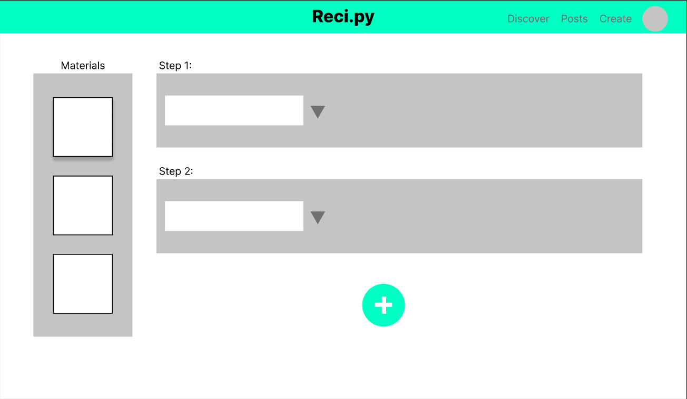

# Reci.py

Reci.py allows people to create & share precise recipes by the tracking
equipment and appliances used to make a recipe, cooking techniques, and more.

### Preparation/dependencies

>>>> Note, I'm pretty sure the scaffold tool below only runs on Linux or Mac. Windows compat coming soon.

You'll need to install:

- A reasonably current version of Python3 & pip3 (NOT 2!!!! This to run orchestration code)
- Docker

Many developers have both of these things already installed, and most POSIX-based environments have python3 installed.

Once you've verified that you have the dependencies installed, do one of these in the project root:

`pip install -e .`

or

`pip install .`

The -e means use the source directory as the target installation directory. This has
the effect of allowing you to edit the code while the package is installed. You
might also need to use sudo to install the package systemwide or use `pip3` instead of `pip` (in the case of having both python2 and python3 installed).

### Running

    scaffold recipy --uploads_dir /path/to/where/uploads/will/be/stored
                    --srcroot /path/to/directory/around/module/

If you're running in the srcroot, just run:

    scaffold recipy

Now go to http://localhost:8000/ to see the webapp. It should just be a blank page with "ok" in it.

### Contributing

Submit a pull request.
